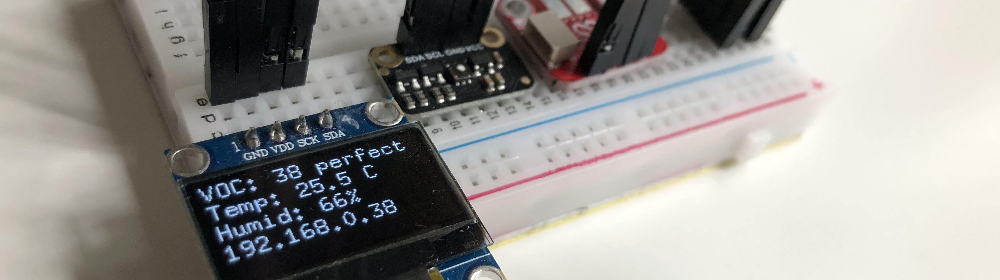

<div align="center">

<h1> Smart Home Server</h1>

[](https://github.com/KristianMika/pv191-smart-home-server/actions/workflows/ci.yaml)

</div>
PV191 Smart Home Server is a simple server application that measures temperature, humidity, and VOC index. The measured data is displayed using an OLED display. The user can access a WEB UI for more thorough data analysis that is available after she has authenticated using a username and password.

## Temperature and Humidity

[SHT40](https://sensirion.com/media/documents/33FD6951/63E1087C/Datasheet_SHT4x_1.pdf) is a capacitive-type humidity and temperature sensor. It measures the relative humidity in the range of 0 - 100 %RH with a precision of ±1% and temperature in the range of -40 °C - 125 °C with a precision < ±0.1 °C.

## Volatile Organic Compounds (VOC)

The setup utilizes Adafruit [SGP40 Air Quality Sensor](https://docs.rs-online.com/1956/A700000007055193.pdf). The sensor uses the aforementioned temperature and humidity sensor to provide data for the computation of compensated VOC index. The index is computed using [Sensirion VOC algorithm](https://github.com/Sensirion/gas-index-algorithm). The algorithm outputs a natural number in the range [0, 500 signalizing indoor air quality. Values below 100 indicate a typical indoor gas composition, while values above 100 indicate deteriorated air quality.

<p align="center">
    
</p>

## UI

<div align="center">
    
    <p> WEB UI after authentication </p>
</div>

## Installation

### Database

A database is necessary for measurement storage. Please, run a Postgresql DB before installing the server application, for example using Docker:

```bash
docker run --name pv191-server-postgres --user postgres -e POSTGRES_PASSWORD=mysecretpassword -d -p 5432:5432 --restart always postgres
```

After the DB server is running, and you've created a database for the application, specify the connection URL in the server unit file (You have to do this step after you've installed the server).

### Server Installation

The server application is provided as a Debian package. The server runs as a _systemd_ service upon installation.

```bash
wget https://github.com/KristianMika/pv191-smart-home-server/releases/download/v0.1.0/smart-home-server_0.1.0_arm64.deb
sudo apt-get install ./smart-home-server_0.1.0_arm64.deb
```

### Nginx Reverse Proxy

To set up a reverse Nginx proxy, follow the official [installation guide](https://www.nginx.com/resources/wiki/start/topics/tutorials/install/) or use the [official Nginx Docker image](https://hub.docker.com/_/nginx). The configuration file is provided in [./nginx.conf](./nginx.conf). Please, note you'll have to generate keys and certificates specified in the configuration file.

Nginx is necessary even if you are not planning on exposing the service to the Internet, as the proxy is used to wrap the traffic in https. Some features, such as notifications, require the https protocol.

### Firewall

In case you are exposing the service to the Internet, consider installing a firewall.

## Architecture

The application consists of 2 services:

1. The _sensor-controller_ service samples sensors in user-specified intervals and stores measurements in the database
2. The _server_ service serves the UI page and exposes API that, after the user has authenticated, provides measurements from the DB.

<div align="center">
    
    <p> Architecture diagram </p>

</div>
