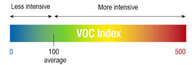
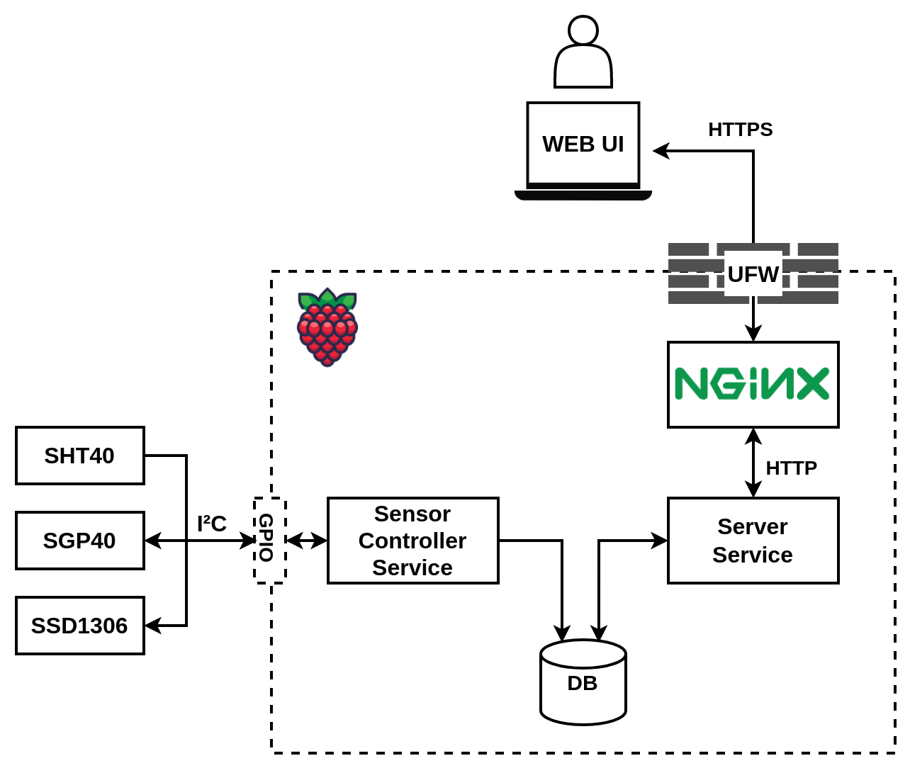

<div align="center">
<h1> Smart Home Server</h1>

[](https://github.com/KristianMika/pv191-smart-home-server/actions/workflows/ci.yaml)

</div>
PV191 Smart Home Server is a simple server application that measures temperature, humidity, and VOC index. The measured data is displayed using an OLED display. The user can access a WEB UI for more thorough data analysis that is available after she has authenticated using a username and password.

## Temperature and Humidity

[DHT22](https://pdf1.alldatasheet.com/datasheet-pdf/view/1132459/ETC2/DHT22.html) is a capacitive-type humidity and temperature sensor. It measures relative humidity in the range of 0-100%RH with a precision of +-5% and temperature in the range of -40°C - 80°C with a precision < +-0.5°C.

## Volatile Organic Compounds (VOC)

The setup utilizes Adafruit [SGP40 Air Quality Sensor](https://docs.rs-online.com/1956/A700000007055193.pdf). The sensor uses the aforementioned DHT22 sensor to provide data for the computation of compensated VOC index. The index is computed using [Sensirion VOC algorithm](https://github.com/Sensirion/gas-index-algorithm). The algorithm outputs a natural number in the range [0, 500 signalizing indoor air quality. Values below 100 indicate a typical indoor gas composition, while values above 100 indicate deteriorated air quality.

<p align="center">
    
</p>

## Installation

### I2C Busses

The server application communicates with the display and VOC index sensor using an I2C interface. Please, follow [this](https://www.instructables.com/Raspberry-PI-Multiple-I2c-Devices/) guide to configure multiple I2C busses on your Raspberry PI.

### Database

A database is necessary for measurement storage. Please, run a Postgresql DB before installing the server application, for example using Docker:

```bash
docker run --name pv191-server-postgres --user postgres -e POSTGRES_PASSWORD=mysecretpassword -d -p 5432:5432 --restart always postgres
```

After the DB server is running, and you've created a database for the application, specify the connection URL in the server unit file (You have to do this step after you've installed the server).

### Server Installation

The server application is provided as a Debian package. The server runs as a _systemd_ service upon installation.

```bash
curl <tbd>.deb
sudo apt-get install ./<tbd>.deb
```

Now navigate to `http://<ip shown on the display>:8080/`

### Architecture

The application consists of 2 services:

1. The _sensor-controller_ service samples sensors in user-specified intervals and stores measurements in the database
2. The _server_ service serves the UI page and exposes API that, after the user has authenticated, provides measurements from the DB.

<p align="center">
    
</p>
